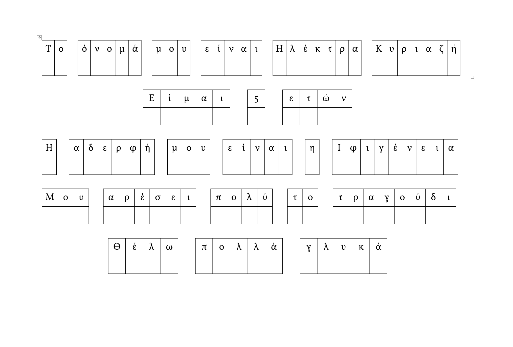

# Simple copy exercises for kids

This is to generate simple exercises for kids to practice their writing. These sentences are sources from a `.json` file and are output to a ready-to-print `.docx` file, through templating.


## Requirements

This tool assumes that you have installed:
- docker
- docker-compose

## Instructions

Place your sentences in a `.json` file inside the `share` folder and do:

```bash
docker-compose run maker /share/electra_template.docx /share/<your_sentences>.json /share/<your_output>.docx
```

Then, collect the output from the `share` folder.
